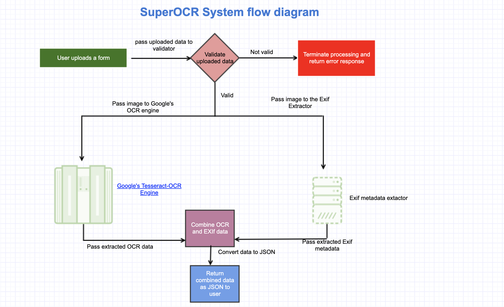

# Super OCR

This is a Flask project which extracts OCR(Optical Character Recognition) data and Exif
(Exchangeable image file format) data from uploaded images.

Users upload the images and the data is returned as a JSON response.

For the OCR data, the project uses [Google's Tesseract-OCR Engine](https://github.com/tesseract-ocr/tesseract) to recognise and read the text embedded in images, a form of optical character recognition (OCR).

The techstack used comprises the following:

- Python 3(>=3.5)
- Flask
- Google's Tesseract-OCR Engine
- pytesseract, a Python wrapper to Google's Tesseract-OCR Engine.
- Skeleton CSS(http://getskeleton.com/) - for the basic styling
- Docker
- pytest as the unit testing framework
- CircleCI for running the tests
- Gunicorn as the Python WSGI app server

## Workflow

The following is a breakdown of the logic of how the system works when a user uploads a file.

- We perform some validations to ensure whatever is uploaded is what we want. These validations include:
  - Ensure a file is present in the data uploaded.
  - Ensure that file is a valid image file
  - Ensure the file is less than or equal to our allowed limit(5MB)
- If any of these validations fail, the processing terminates and we return an appropriate error
response to the user.
- If the validation is success we save the image in the file system and pass its absolute path
to the OCR Engine and the Exif Data Extractor for processing.
  - The OCR engine recognise and read the text embedded in image(if any) and returns it as dictionary.
  - Exif Data Extractor extracts all exif metadata(if any) and returns it as a dictonary
- The extracted OCR and Exif metadata are combined and returned as a JSON object to the user.

Here is the workflow as a digram:



### Sample response

`POST /` with image file

```json
{
    "image_text": "No text detected in image",
    "metadata": {
        "ApertureValue": [
            25260,
            10000
        ],
        "BrightnessValue": [
            0,
            0
        ],
        "ColorSpace": 1,
        "ComponentsConfiguration":"",
        "DateTime": "2014:11:07 13:49:58",
        "DateTimeDigitized": "2014:11:07 13:49:58",
        "DateTimeOriginal": "2014:11:07 13:49:58",
        "DigitalZoomRatio": [
            100,
            100
        ],
        "ExifImageHeight": 1664,
        "ExifImageWidth": 2496,
        "ExifOffset": 243,
        "ExifVersion": "0220",
        "ExposureBiasValue": [
            0,
            0
        ],
        "ExposureMode": 0,
        "ExposureProgram": 0,
        "ExposureTime": [
            292,
            10000
        ],
        "FNumber": [
            24,
            10
        ],
        "Flash": 0,
        "FlashPixVersion": "0100",
        "FocalLength": [
            439,
            100
        ],
        "GPSInfo": {
            "0":"",
            "7": [
                [
                    10,
                    1
                ],
                [
                    49,
                    1
                ],
                [
                    57,
                    1
                ]
            ],
            "29": "2014:11:07"
        },
        "GainControl": 0,
        "ISOSpeedRatings": 100,
        "ImageDescription": "Jpeg",
        "ImageLength": 1664,
        "ImageWidth": 2496,
        "LightSource": 0,
        "Make": "Intel",
        "MaxApertureValue": [
            24,
            10
        ],
        "MeteringMode": 0,
        "Model": "BT210",
        "Orientation": 6,
        "ResolutionUnit": 2,
        "SceneCaptureType": 0,
        "Sharpness": 0,
        "ShutterSpeedValue": [
            -2147483648,
            10000
        ],
        "Software": "Android",
        "SubjectDistance": [
            0,
            1
        ],
        "UserComment":"ASCII  ",
        "WhiteBalance": 0,
        "XResolution": [
            72,
            1
        ],
        "YCbCrPositioning": 1,
        "YResolution": [
            72,
            1
        ]
    }
}
```

`image_text` is the OCR detected text while `metadata` is the Exif metadata extracted from the uploaded image.

If there is no text detected by OCR, `image_text` will be `No text detected in image` while if there
is no Exif metadata, `metadata` will be an empty dictionary.

## Using the Docker Image

The project exists as a ready to use docker image on Docker hub.

Pull it locally:

`docker pull donmanyo/superocr`

You can run it locally on `PORT 7777` like so, or on any other PORT of your choice:

`docker run -p 7777:5000 donmanyo/superocr`

You can visit the homepage in the browser `http://localhost:7777/` which will display a simple upload form. Use this to test the functionality.

OR better still, you can open the same in Postman and upload the file. Make the image file has the key `file`.

## Local setup

You can also clone the repo from Github and run the project locally without Docker.
The project uses 

Clone the repo:

`git clone https://github.com/msomierick/superocr.git`

Create a virtual environment and install the dependencies(Use Python>=3.5):

```bash
python3 -m venv venv
. venv/bin/activate
pip install -r requirements.txt
```

Start the Flask project thus:

`python3 manage.py`

Visit `http://localhost:7777/` either with Postman or a browser to it working.

## Running unit tests

The project uses [pytest](https://docs.pytest.org/en/latest/) as the testing framework and
[Coverage](https://coverage.readthedocs.io/en/v4.5.x/) for generating the test coverage reports.

Run the tests thus, within the cloned repo root folder and the virtual environment activated:

`pytest`

You can view the Coverage HTML test report by open `htmlcov/index.html` in a browser of your choice.

The project is also integrated with CircleCI for running the tests. The CircleCI tests can be viewed [here](https://circleci.com/gh/msomierick/superocr).
